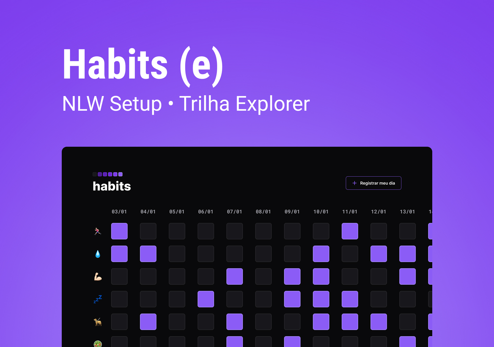

<h1 align="center"> Habits </h1>

Um programa em que coloca-se o seus hábitos desenvolvido no evento NLW da Rocketseat 

  <a href="#-tecnologias">Tecnologias</a>&nbsp;&nbsp;&nbsp;|&nbsp;&nbsp;&nbsp;
  <a href="#-projeto">Projeto</a>&nbsp;&nbsp;&nbsp;|&nbsp;&nbsp;&nbsp;
  <a href="#-layout">Layout</a>&nbsp;&nbsp;&nbsp;|&nbsp;&nbsp;&nbsp;
  <a href="#memo-licença">Licença</a>

  

 

  

## 🚀 Tecnologias

Esse projeto foi desenvolvido com as seguintes tecnologias:

- HTML e CSS
- JavaScript
- Git e Github
- Figma

## 💻 Projeto

O Habits é um app para rastrear os hábitos.

## 🔖 Layout

Você pode visualizar o layout do projeto através [DESSE LINK](<https://www.figma.com/file/7N8NCN9ybTuZwj3CMcc3zW/Habits-(e)-(Community)?node-id=75%3A128>).

## :memo: Licença

Esse projeto está sob a licença MIT.

---

Feito com ♥
